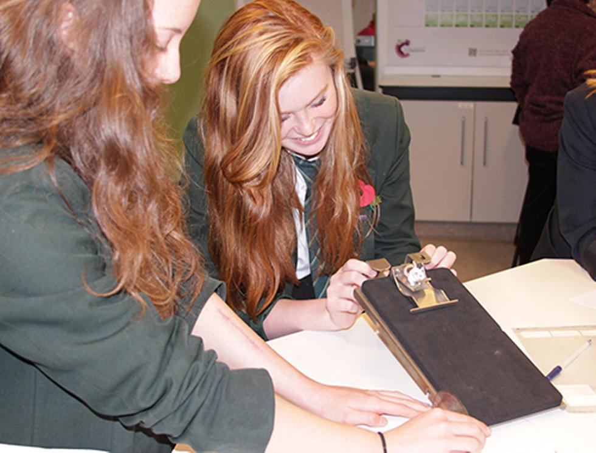
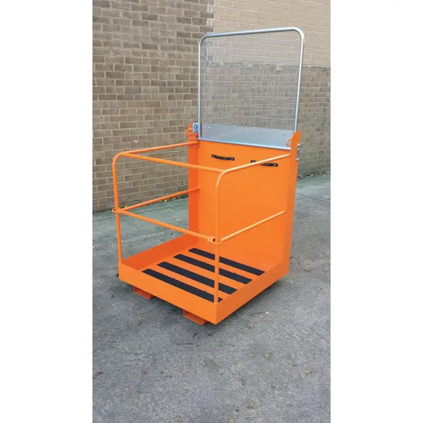
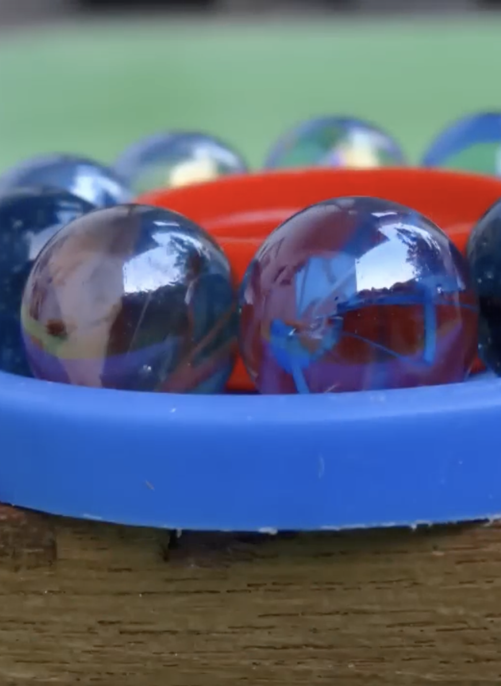
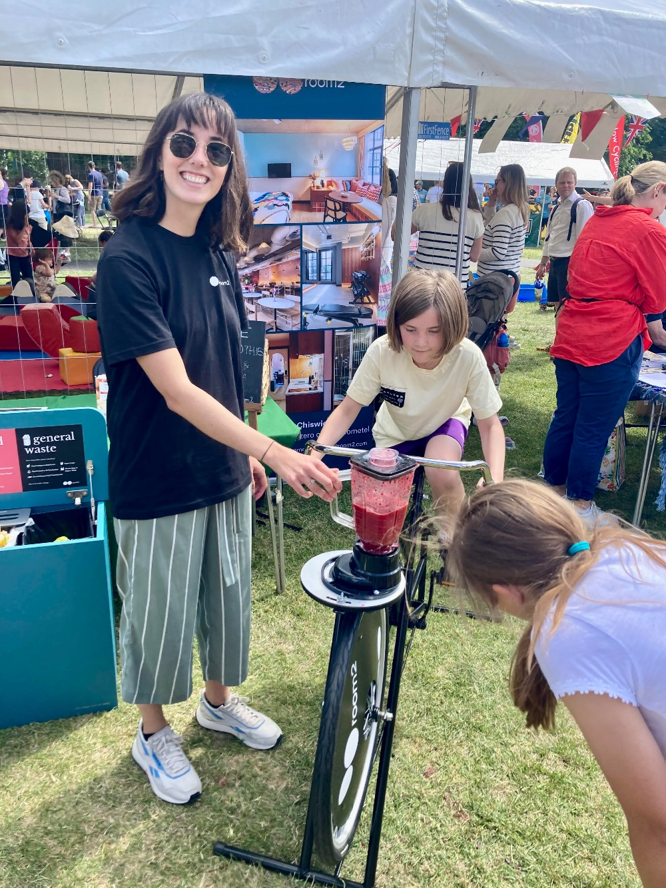

Outreach Activity Plan

# "Get Your Bearings!"

James Carlyle

15 January 2025
AI for Sustainability CDT
University of Southampton

## Introduction
TriboAI is a spinout from the Faculty of Engineering (FEPS) at the University of Southampton, and focuses on improving the detection of wear in industrial bearings using AI, in order to allow preventative maintenance and avoid catastrophic failure.

Wear and lubrication are everyday concerns, and "Tribology" is the name of the science behind them. This report details an outreach activity for Southampton Science and Engineering Festival (SOTSEF) as an opportunity for young students to become more engaged with science and the work of the university, through playful activities which demonstrate tribology at work.

Taking part in SOTSEF also provides a chance for the TriboAI team and the university to engage with the local community which supports them, and pay forward for the next generation.

---

## Audience

**Primary audience:** Secondary school students (ages 11–16) attending SOTSEF, with varying levels of prior knowledge of physics and mechanics, gained through GCSE study and Lego-like building play.

**Characteristics:**
- **Educational background**: Friction is introduced as a science concept at Key Stage 3 (secondary school education in England and Wales) for pupils aged 11 to 14. For example, simple experiments are detailed on [BBC Bitesize](https://www.bbc.co.uk/bitesize/articles/z6s4r2p#zt42qfr). 
- **Prior knowledge**: Basic understanding of friction and Newton's laws, but limited or no exposure to mechanical engineering applications.
- **Motivation**: Curiosity about how everyday machines work; hands-on learning experience should be more enjoyable than passive lectures.
- **Barriers to engagement**: Technical jargon (e.g., "stress," "wear") and misconceptions that bearings are "magic" rather than simple physics-based objects. Bearings are mostly invisible in household products.

**Stakeholder benefits:**
- **Students:** Understand the practical application of friction physics; experience hands-on experimentation; gain interest in engineering careers.
- **TriboAI (as a bearing supplier):** Brand visibility, direct engagement with future customers, feedback on public perception of bearing technology, demonstration of real-world relevance.

--- 

## Aims

1. **Improve understanding of friction reduction mechanisms** – Students will grasp how rolling friction is significantly lower than sliding friction through a direct comparison, and will have an intuition about how bearing wear affects friction.
2. **Connect physics concepts to engineering applications** – Students will identify where bearings are used in real machines (bikes, cars, wind turbines) and understand why. They will also appreciate how friction is equally important.
3. **Increase interest in mechanical engineering** – Students will leave with curiosity about how machines work, how friction makes machines less efficient, and how bearings are embedded in everyday machines.

---

### Why have activities been designed this way?

**Format:** Interactive hands-on demonstration station ("Get Your Bearings!") at SOTSEF, running in 4–5 minute cycles per group of 2–4 students.

**Level of interactivity:** Fully hands-on engagement is essential for this audience. Kinesthetic learning (feeling the force difference) is more memorable than explanation alone, especially for younger students who learn through doing.

**Use of demonstrations:** Actual ball/marble bearings let students see and touch the technology. A cutaway display bearing from TriboAI's stock connects the DIY model to real engineering. Photos of bearing applications join abstract physics to familiar objects (bikes, cars).

**Length and group size:** 4–5 minutes is optimal for SOTSEF settings where multiple groups rotate through. Small groups (2–4 students) allow everyone to participate actively and ask questions.

**Delivery mode:** In-person, hands-on activity is essential for this age group. It maximizes engagement and allows facilitators to address misconceptions directly. It fits well within SOTSEF's format of distributed stations.

**Justification:** This format addresses all three aims: it physically demonstrates friction reduction (aim 1), shows real-world bearing applications (aim 2), and the novelty and interactivity drive genuine interest (aim 3).

---
## Activity 1: Friction and Bearings in Everyday Objects

The goal of this activity is to show how we depend on friction, and on bearings, during our everyday lives. The demonstration uses a children's bicycle to illustrate this, as well as jam-jar lids rolling on marbles contained within the lid rim on a flat surface.

### What is the activity?

1. **Prediction phase:** A bike is brought to the front of the group. Students predict where on a bike it be good to have low levels of friction and wear, and conversely where friction is absolutely necessary.
2. **Experimentation phase:** The instructor points out some of the obvious places where bearings are used to lower friction, such as the wheel hubs, the bottom bracket (crankset rotation), the pedal spindles, and the headset (the handlebar pivot point).
The instructor can also show where friction is needed, such as the rubber of the tyres, and the pads of the brakes. 
The students can handle the jam-jar lid bearing demonstrators, and quickly see what difference the marbles make to the effort required to push the lid around.
3. **Discussion:** The instructor can guide the students to think about what makes a good pair of materials where friction is required, for example rubber against a flat metal surface, or rubber against a road surface.

---

## Activity 2: Bearing Wear

The goal of this activity is to go further and demonstrate the difference in friction between smooth and rough bearings, in a format which encourages physical movement in a safe environment. This is close to the product of TriboAI but doesn't get into detail of detection and analysis which would overwhelm an 11 year old.

The activity requires a smooth surface surrounded by a boundary safety rails, such as pictured. A slightly smaller flat plywood sheet sits within this constrained space on smooth bearings (marbles) or rough bearings (20-sided dice). 

### What is the activity?

1. **Prediction phase:** Students predict which will be easier: sliding a platform across a surface, or rolling it on marbles acting as bearings, or rolling it on imperfectly round spheres.
2. **Experimentation phase:** Students physically push/pull the platform while their friend is standing on it, with and without marbles or dice under it, measuring the effort required. If a friend is not available, the student can push themselves agains the safety frame. The student is safely constrained by the frame, so they cannot fall over.
3. **Comparison phase:** Students observe the clear difference and discuss why rolling is more efficient, and how rough bearings (dice) increase the force and work required to move.
4. **Real-world connection:** Display examples (cut-away worn bearings, damaged skateboard wheels) showing where this principle is used.

---

## Cost and Practical Considerations

**Materials** (low-cost, reusable):
- Glass/plastic marbles: £10–20 for bulk pack (~50 marbles).
- 20-sided dice: available for £20 for 50 dice.
- Wooden platforms or jar lids: free (upcycled) or £5–10.
- Test surfaces: carpet offcuts, sandpaper, smooth board (mostly free or scrap).
- Tape, markers, measurement tools: standard office supplies (~£5).
- Display cutaway bearing (TriboAI inventory): no cost.
- Safety frame for platform: likely £200-300.

**Venue:** SOTSEF provides tables; no additional venue cost. TriboAI may like to provide some branded posters, but this is **not** a trade show.

**Staff/facilitator:** 1–2 trained facilitators per station, each shift ~2–3 hours. Can rotate with other supplier staff.

**Practical setup:** Requires ~30 minutes to assemble (lay out test surfaces, arrange marbles, prepare display). Easily transportable in two boxes.

**Scalability:** Can run simultaneously at multiple tables if needed. Activity is robust and forgiving; marbles don't break, setup is quick.

**Total estimated cost:** £20–40 for materials excluding frame, reusable for multiple events.

---

## Assessment and Evaluation

### How will data be collected?

**Method 1: Short post-activity questionnaire** (~1 minute, optional)
- Simple questions: "What did you learn about friction?" "Where have you seen bearings today?" Likert scale (strongly agree to strongly disagree) or free text answers.
- Captures immediate learning and engagement.

**Method 2: Observation during activity**
- Facilitator notes engagement level (passive vs. active participation).
- Records student questions and misconceptions addressed.
- Tracks interest in the real-world application display.

**Method 3: Brief verbal feedback**
- Ask 1–2 students per session: "What surprised you?" "Would you want to know more about bearings?".
- Informal but informative.

---

### Ethical considerations 

- No names recorded.
- Participation in feedback is optional.
- Data aggregated across all sessions for anonymity.
- Focused on activity effectiveness, not student performance.

### What will be evaluated?

Evaluation will measure success against each aim:

1. **Understanding of friction reduction:** Do students grasp that rolling is more efficient than sliding? Can they articulate why? Can they explain why efficiency is lost when bearings become rough?
2. **Engagement and interest:** Did students actively participate? Did they ask follow-up questions or show curiosity about bearing applications?
3. **Retention of real-world connections:** Can students name or identify machines that use bearings after the activity?

## Summary

This activity is realistic, cost-effective, and directly addresses the needs of a secondary school audience while delivering clear benefits to the bearing supplier. The hands-on format ensures high engagement and lasting understanding of friction and engineering applications.