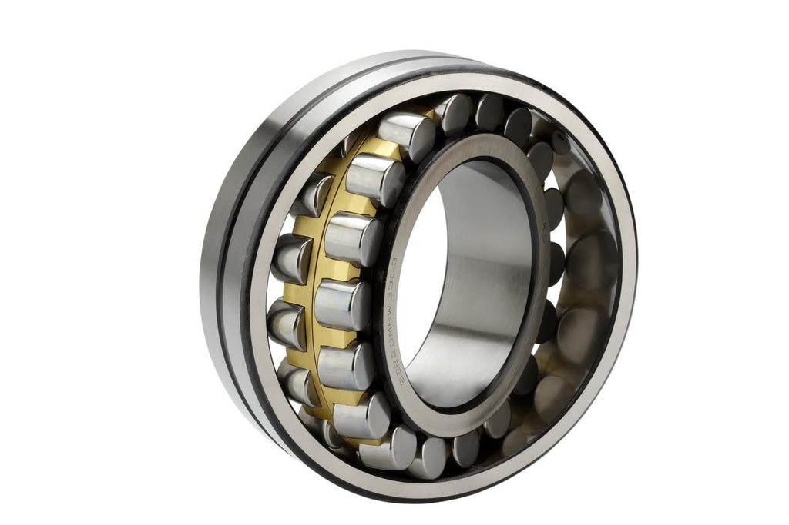
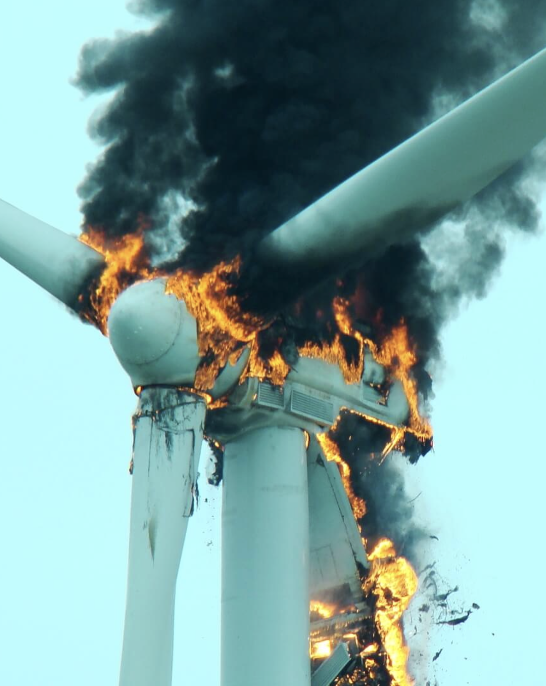
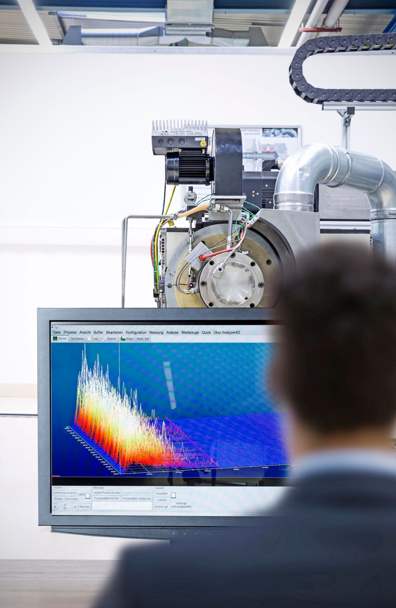
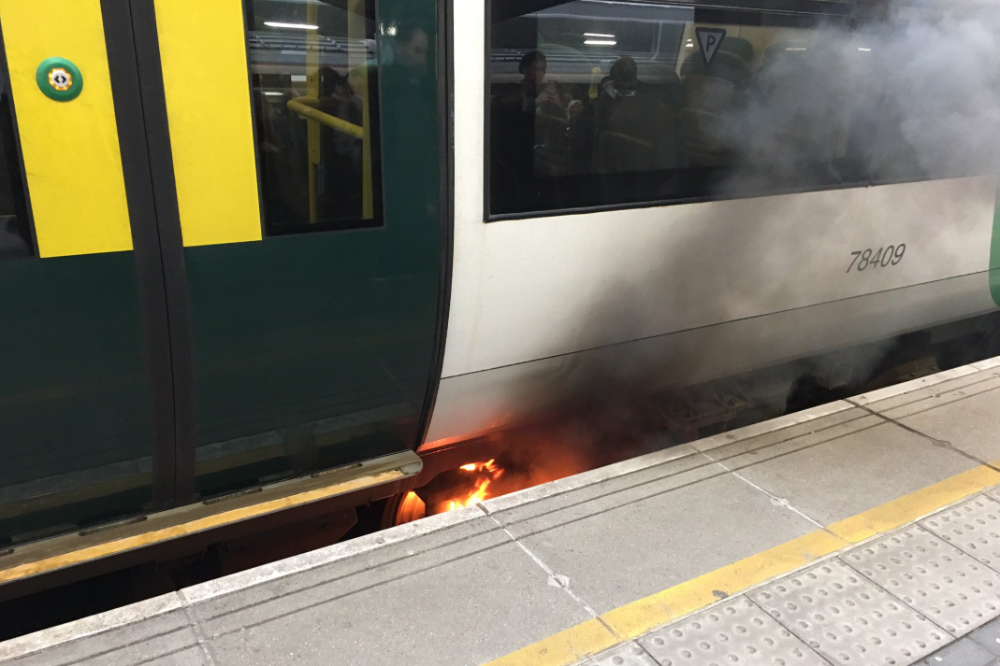

Policy Briefing 
# TriboAI : The Future of Industrial Resilience

**Date:** January 16, 2026  
**To:** UK Department for Business and Trade; Department for Energy Security and Net Zero  
**From:** TriboAI Team (a spinout from the University of Southampton)  
**Subject:** Launch of TriboAI: Leveraging Electrostatic Intelligence for Net Zero Maintenance

## 1. Summary

This briefing discusses the policy implications of the work of **TriboAI**, a University of Southampton spinout that has operationalized twenty years of research from the national Centre for Advanced Tribology at Southampton (nCATS). TriboAI introduces a novel **electrostatic condition monitoring system** integrated with AI-driven outlier detection. This technology fundamentally alters the economics of industrial maintenance by enabling the detection of wear *before* physical damage occurs, unlike traditional vibration-based methods.

The deployment of TriboAI directly supports the UK’s **Net Zero 2050** and **Digital Industry** strategies. By transitioning critical infrastructure from "preventative" (schedule-based) to "predictive" (condition-based) maintenance, this technology reduces material waste, prevents catastrophic failures, and crucially, de-risks the adoption of sustainable "green" lubricants .

---

## 2. Key Findings: The "Run-to-Failure" Dilemma

UK industry currently faces a costly dilemma in machinery operation:

### 2.1 The Risk of Catastrophic Failure
When maintenance fails to predict rapid degradation, the consequences are severe.
*   **Safety Criticality:** Bearings are single points of failure in wind turbines, trains, and jet engines. Defective bearings have been directly linked to major recent incidents in the UK, such as the 2018 Leicester helicopter crash, killing 5, or the 2010 East Langton train derailment while travelling at 100 mph.
*   **Blind Spots:** Traditional sensors (vibration, thermal) often detect faults only after surface damage has initiated, leaving little margin for intervention.

### 2.2 The Economic Cost of Caution
Current maintenance regimes are inherently conservative. To avoid failure, operators replace bearing components and lubricants based on fixed time intervals, regardless of their actual health. 
*   **Scale of Waste:** In the rail sector alone, the global bearing market is valued at over **$1–3.5 billion**, yet approximately **1 million bearings** are replaced and discarded unnecessarily each year.
*   **Resource Drain:** This "better safe than sorry" approach forces the premature disposal of steel components and petrochemical lubricants that still possess significant useful life.

---

## 3. The Innovation: Electrostatic Intelligence

TriboAI addresses this gap by commercializing a "smart machine" solution that fuses novel hardware with proprietary machine learning.

### 3.1 Advanced Electrostatic Sensing
Unlike vibration sensors that listen for the "noise" of a broken part, TriboAI’s electrostatic sensors detect the **precursor signals** of wear. The system monitors the electrostatic charge generation associated with microscopic surface distress and lubricant film breakdown. This allows for:
*   **Real-time Wear Evolution:** Monitoring the actual condition of the contact interface.
*   **Lubricant Health:** Detecting the exact moment a lubricant film fails, rather than relying on estimated lifespan.

### 3.2 AI-Driven Diagnostics
The hardware is paired with an AI detection system trained on outlier detection methods.
*   **Abnormal Event Detection:** The system identifies deviations from "healthy" baselines without needing to be trained on every possible failure mode.
*   **Contextual Fusion:** By integrating multi-sensing data (friction, temperature, vibration), the AI model pinpoints specific failure modes, reducing false alarms and enabling targeted maintenance actions.

---

## 4. Recommendations for Policy Makers

To fully benefit from this UK-born innovation, we recommend the following actions:

1.  **Mandate "Smart Maintenance" Standards:** Public sector procurement for infrastructure (e.g. Transport, Defense, Energy) should prioritize bids that include verifiable predictive maintenance strategies, moving away from legacy "time-based" contracts.
2.  **Support "Green Lubricant" Pilot Programs:** Innovate UK should fund large-scale trials that pair bio-lubricants with TriboAI monitoring. This "monitor-and-verify" approach will provide the data needed to update industrial standards (ISO/ASTM) for green fluids.
3.  **Incentivize Remanufacturing:** Tax incentives or capital allowances should be considered for operators who demonstrate high rates of component remanufacturing enabled by digital monitoring technologies.

## 5. Economic Impact Assessment

Adopting TriboAI’s predictive capability offers a transformative ROI for UK industry, estimated to deliver **18–25% cost reductions** versus standard approaches and up to **40% savings** over reactive maintenance.

The most immediate economic benefit is the extension of asset life.
*   **Optimized Usage:** Bearings can be run to more than 90% of their true fatigue life rather than being discarded at 50%.
*   **The Remanufacturing Opportunity:** A refurbished bearing costs only **10%** of the energy and materials of a new unit but can achieve **90%** of the lifespan, *if* it is removed before deep damage occurs. TriboAI provides the precise timing required to make remanufacturing viable at scale.

For sectors like offshore wind, where maintenance access is weather-dependent and costly, the ability to predict failure months in advance allows for:
*   **Reduced** unplanned downtime.
*   **Consolidation of maintenance trips**, significantly lowering the Levelized Cost of Energy (LCOE).

---

## 6. Alignment with UK National Policy Priorities

TriboAI acts as a technological enabler for broader UK policy goals, aligned to the **UN Sustainable Development Goals (SDGs)**.

### 6.1 Enabling the Green Transition (Net Zero 2050)
*   **De-risking Green Lubricants (SDG 12):** Industry leaders are hesitant to switch to plant-based (bio) lubricants due to uncertainty about their long-term performance. TriboAI acts as a safety net, monitoring these new fluids in real-time to build operator confidence and accelerate the phase-out of fossil-fuel lubricants.
*   **Clean Energy Reliability (SDG 7):** By improving the reliability of wind turbine drivetrains, the technology directly supports the expansion of the UK’s renewable energy capacity.

### 6.2 Environmental Protection (SDG 6, 14, 15)
*   **Groundwater Safety:** Lubricant leakage and improper disposal pose risks to water tables. By extending lubricant life and preventing catastrophic seal failures (which often lead to leaks), TriboAI mitigates industrial contamination risks.

### 6.3 Decent Work & Safety (SDG 8)
*   **Reducing Hazardous Maintenance:** Premature replacement of heavy machinery is "difficult, dirty, and dangerous" work. Reducing the frequency of these interventions minimizes worker exposure to hazardous environments (e.g., trackside rail maintenance, offshore platforms).

---

## 7. Conclusion

TriboAI represents the successful translation of academic excellence into industrial value. By solving the "uncertainty problem" in maintenance, it offers a pathway to a more productive, safer, and sustainable industrial base. The release of this product is not just a commercial milestone but a critical tool in the UK’s journey to Net Zero.

**Further Reading**:
TriboAI: https://triboai.co.uk/
UN Sustainable Development Goal 7, Clean Energy: https://www.un.org/sustainabledevelopment/energy/
Wind Energy Contribution to the Sustainable Development Goals, London Array: https://www.mdpi.com/2071-1050/15/5/4641
UK Rail Safety and Standards: RIS-2714-RST Iss 1 Axle Bearing Condition Monitoring: https://www.rssb.co.uk/standards-catalogue/
Early wear detection and its significance for condition monitoring: https://www.sciencedirect.com/science/article/pii/S0301679X21000943

**Author**: 
James Carlyle has spent a career in industrial manufacturing, building heavy machinery in Japan, and software engineering, designing some of the largest payment and accounting systems for Barclays Bank. He holds a degree in Mechanical Engineering from Durham University, and is pursuing a PhD in AI for Sustainability at the University of Southampton. He is a Chartered Electrical Engineer and has been granted multiple patents in fields of data processing and distributed ledgers.